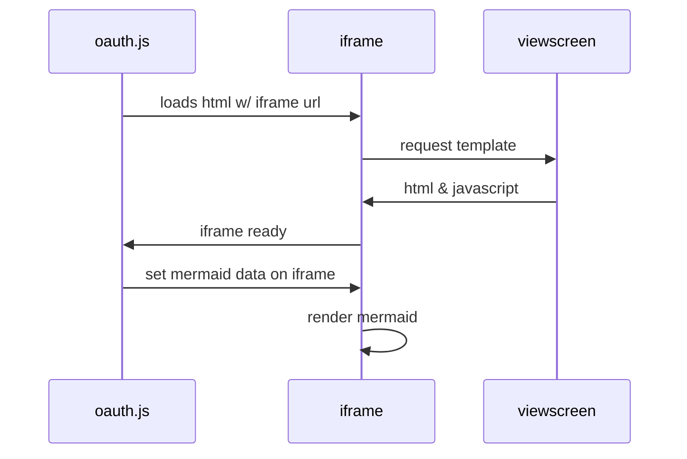

# Reference Integration

This is a sample application demonstrating an end to end Checkr integration. It outlines best practices and patterns we see Checkr integrations adopt, and will help you develop a Checkr certified integration. It focuses on two use-cases:
* How to use the [Checkr-Hosted Signup flow](https://docs.checkr.com/partners/#section/Getting-Started/Connect-your-customers-to-Checkr) to connect your customers to Checkr. 
* How to order background checks and report results via [Checkr Embeds](https://docs.checkr.com/embeds).

You can refer to this application if you are building either one or both use-cases. 

 

 

# Contents

* [Live Sandbox](#live-sandbox)
* [Connecting customers](#connecting-customers)
* [Using Embeds to order background checks](#using-embeds)
* [Resources](#resources)
* [Running it locally](#running-it-locally)
* [Got feedback?](#got-feedback)

## Live sandbox

An instance of this application is hosted at [checkr-embeds-integration.herokuapp.com](https://checkr-embeds-integration.herokuapp.com). It is connected to a demo staging Checkr account which does not run real background checks.

You can also deploy this using your own Heroku account and connect it your Checkr account.

## Connecting customers

With Checkr OAuth, your customers can easily connect their Checkr account with your product. It gives your product the ability to make API calls on behalf of your customers. This described in more detail in our [partner guide](https://docs.checkr.com/partners/#section/Getting-Started/Connect-your-customers-to-Checkr).

#### Application components

| Component                                                                                                                                       | Responsibility | Code walkthrough                                                                       | 
|-------------------------------------------------------------------------------------------------------------------------------------------------|----------------|----------------------------------------------------------------------------------------|
| [oauth.js]()                                                                                                                                    | Does foo       | [walkthrough](https://checkr-embeds-integration.herokuapp.com/docs/routes/checkr.html) |
| [CheckrConnectButton.js](https://github.com/checkr/embeds-reference-integration/blob/main/client/src/components/account/CheckrConnectButton.js) | Does bar       | [walkthrough](https://checkr-embeds-integration.herokuapp.com/docs/routes/checkr.html) |

## Using Embeds to order background checks

Embeds provide Javascript and React components to quickly build an experience to order background checks and view results. Read more about it [here](https://docs.checkr.com/embeds/).  

#### Application components

| Component                                                                                                                                       | Responsibility | Code walkthrough                                                                       | 
|-------------------------------------------------------------------------------------------------------------------------------------------------|----------------|----------------------------------------------------------------------------------------|
| [oauth.js]()                                                                                                                                    | Does foo       | [walkthrough](https://checkr-embeds-integration.herokuapp.com/docs/routes/checkr.html) |
| [CheckrConnectButton.js](https://github.com/checkr/embeds-reference-integration/blob/main/client/src/components/account/CheckrConnectButton.js) | Does bar       | [walkthrough](https://checkr-embeds-integration.herokuapp.com/docs/routes/checkr.html) |

## Resources

* [API docs](https://docs.checkr.com)
* [Partner Guide](https://docs.checkr.com/partners)
* [Embeds docs](https://docs.checkr.com/embeds)

## Running it locally

View the [development page](docs/Developing.md) to run this project locally.

## Got feedback?

[Open an issue](https://github.com/checkr/embeds-reference-integration/issues) in this repository to ask a question or give us feedback.
